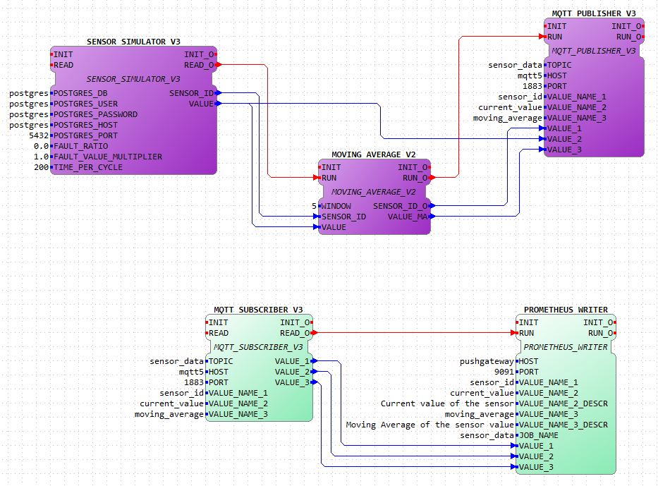

# MES for Industrial Automation

Our product aims to be a helpful, all-encompassing tool for industrial organizations to achieve the goals of [Industry 4.0](https://www.ibm.com/topics/industry-4-0) that consist in improving product quality, reducing costs, and meeting regulatory requirements while staying adaptable to changing market conditions. More information about our product's vision and objectives can be found in the [Product Management](docs/product.md) document.
 

## How to use

### Requirements

- [Docker](https://www.docker.com/) or [Docker Desktop](https://www.docker.com/products/docker-desktop/). This will be used to containerize the different services used in the project.

- [Python 3](https://www.python.org/downloads/) (At least version 3.8). This is required to run the data generator and to push this data to the **PostgreSQL** database.

- [pip](https://pip.pypa.io/en/stable/installing/). This is required to install the python packages.

- Install 4DIAC-IDE for your system. This will be used to configure the dataflow pipeline. You can install using any of these permalinks:

  - [4diac IDE 1.11.0 Windows 64-bit](http://www.eclipse.org/downloads/download.php?file=/4diac/releases/1.11/4diac-ide/4diac-ide-incubation_1.11.0-win32.win32.x86_64.zip)
  - [4diac IDE 1.11.0 Linux 64-bit](http://www.eclipse.org/downloads/download.php?file=/4diac/releases/1.11/4diac-ide/4diac-ide-incubation_1.11.0-linux.gtk.x86_64.tar.gz)
  - [4diac IDE 1.11.0 Mac OS X](http://www.eclipse.org/downloads/download.php?file=/4diac/releases/1.11/4diac-ide/4diac-ide-incubation_1.11.0-macosx.cocoa.x86_64.dmg)

  **NOTE**: In case the permalinks get outdated, you can install using the from this [online folder](https://drive.google.com/drive/folders/1BG9jSN6q5V6J5MTj7w3r6gF6OH6iEOvm)

  **NOTE**: For more details about the 4DIAC-IDE, check this [link](https://eclipse.dev/4diac/en_help.php?helppage=html/4diacIDE/overview.html).

  **NOTE**: After instalation, ensure you have the 4DIAC-IDE outside of the root of this project, otherwise it will be submited to git.

- (Optional for now) Install [Prosys OPC UA Browser 4.4.0-126](https://www.prosysopc.com/products/opc-client/). This OPC client can be used to observe the results of the OPC UA server built in DINASORE.

### Installation / Setup

- First of all, make sure you are in the `/src` directory of the project.

- If you are running **Windows**, you can use the `install.bat` script. Otherwise, if you are using **Linux** or **Mac OS**, you can use the `install.sh` script.

- This will install the necessary python packages and create the necessary docker containers, those being:

  - `Grafana` running under the port `3000`;
  - `pgAdmin` running under the port `4321`;
  - `PostgreSQL` running under the port `5432`;
  - `Prometheus` running under the port `9090`;
  - `Prometheus Pushgateway` running under the port `9091`.
  - `Mosquitto MQTT Broker` running under the port `1883`.
  - `Dinasore (instance 1)` running under the port `61499` and `4840`.
  - `Dinasore (instance 2)` running under the port `61500` and `4841`.

  The script will populate the `PostgreSQL` database with the necessary tables and data after the containers are up and running. Also generates fresh new data to be used overall.

  The generated data consists of 3 facilities. Each facility has 5-10 systems. Each system has 2-5 expansions, and each expansion 1-2 sensors. From here, a system can have 3 different tasks associated and it is generated, for 24h, the distribution of tasks for each system. Tasks can also have gaps between them, which means that a system can be idle for a certain amount of time.

### Usage

#### Prometheus

To access the `Prometheus` interface, go to [this link](http://34.42.26.53:9090).

To verify if the data is being scraped from the `Pushgateway` server, go to the `Status > Targets` tab and check if the `pushgateway` is up and running. If it is, it should show `UP` under the `State` column.

On the `Expression` tab, you can enter a query to verify the data that is being scraped. For example, you can enter the following queries:

```sql
current_value
-- or
current_value{sensor_id="1"}
-- or
moving_average{sensor_id="1"}
```

The first one will show all the sensors data, while the second one will only show the value of the sensor with id `1`.

### Grafana

To access the `Grafana` interface, go to [this link](http://34.42.26.53:3000). Login with the following credentials:
```markdown
**Username**: admin
**Password**: admin
```

Afterwards, you will be redirected to the `Home Dashboard`.

From there, select on the left side the `Dashboards` tab. This will show the available dashboards folders. Select the `General` folder and then select the `General View` dashboard. 


Here, you can see the current data hold both by the `PostgreSQL` database and the `Prometheus` database. You can also select the time range of the data to be shown, as well as play with the different variables to see how the data changes.

#### 4DIAC-IDE

o open the 4DIAC-IDE, go to the folder where you installed it and run the `4diac-ide.exe` file.

The Dinasore instances, which will be used by the 4DIAC-IDE, are running under the ports `61499` and `4840` for the first instance and `61500` and `4841` for the second instance, for the DIAC and OPC UA ports, respectively.

Now, you can open the 4DIAC-IDE and import the [function blocks folder](./resources/function_blocks/). For that, you can follow the next steps:

  1. Open the 4DIAC-IDE
  2. Go to File -> New -> New System -> *Name the project as **MES*** -> Finish
  3. On the System Explorer, left click to open the **MES** -> Right click on the **Type Library** -> Import -> General -> File System -> Next -> Browse -> Select the [function blocks folder](./resources/function_blocks/) -> Finish
  4. On the System Explorer, open **System Configuration** (**1**). Now add 2 FORTE_PC (**2**) and 1 Ethernet (**3**). Link the Forte PCs to the Ethernet (**4**). Update the port of the second FORTE_PC to 61500 (**5**).

     

  5. On the System Explorer, open **MESApp**
  6. From the palette on the right side, drag the following function blocks:

     - **SENSOR_SIMULATOR_V3**
     - **MOVING_AVERAGE_V2**
     - **MQTT_PUBLISHER_V3**
     - **MQTT_SUBSCRIBER_V3**
     - **PROMETHEUS_WRITER**

     

  7. Now, proceed to link the function blocks and fill the parameters with:

     - **SENSOR_SIMULATOR_V3**: 
       - POSTGRES_DB = *postgres*. This is the name of the database.
       - POSTGRES_USER = *postgres*. This is the username of the database.
       - POSTGRES_PASSWORD = *postgres*. This is the password of the database.
       - POSTGRES_HOST = *postgres*. This is the IP address of the PostgreSQL database on your machine.
       - POSTGRES_PORT = *5432*. This is the port of the PostgreSQL database on your machine.
       - FAULT_RATIO = *0*. This is the failure ratio of the sensors. You can change this value to see how the failure ratio affects the data.
       - FAULT_VALUE_MULTIPLIER = *1*. This is the multiplier of the fault value. You can change this value to see how the fault value multiplier affects the data. > 1 means that the fault value will be higher than the normal value, < 1 means that the fault value will be lower than the normal value.
       - TIME_PER_CYCLE = *200*. This is the time, in seconds, that the sensor simulator will take for each cycle. You can change this value to see how the time per cycle affects the data.

     - **MOVING_AVERAGE_V2**: WINDOW = 5. This value is the number of samples that the moving average will use to calculate the average value. You can change this value to see how the moving average changes.
     - **MQTT_PUBLISHER_V3**:
       - TOPIC = *sensor_data*. This is the topic that the publisher will use to publish sensor data to.
       - HOST = *mqtt5*. This is the IP address of the MQTT Broker on your machine.
       - PORT = *1883*. This is the port of the MQTT Broker on your machine.
       - VALUE_NAME_1 = *sensor_id*. This is the id of the sensor.
       - VALUE_NAME_2 = *current_value*. This is the current value of the sensor.
       - VALUE_NAME_3 = *moving_average*. This is the moving average of the sensor.
     - **MQTT_SUBSCRIBER_V3**:
       - TOPIC = *sensor_data*. This is the topic that the subscriber will use to subscribe to.
       - HOST = *mqtt5*. This is the IP address of the MQTT Broker on your machine.
       - PORT = *1883* This is the port of the MQTT Broker on your machine.
       - VALUE_NAME_1 = *sensor_id*. This is the id of the sensor.
       - VALUE_NAME_2 = *current_value*. This is the current value of the sensor.
       - VALUE_NAME_3 = *moving_average*. This is the moving average of the sensor.
     - **PROMETHEUS_WRITER**:
       - HOST = *pushgateway*. This is the IP address of the Prometheus Gateway running on docker.
       - PORT = *9091*. This is the port of the Prometheus Gateway running on docker.
       - VALUE_NAME_1 = *sensor_id*. This is the id of the sensor.
       - VALUE_NAME_2 = *current_value*. This is the current value of the sensor.
       - VALUE_NAME_2_DESCR = *Current value of the sensor*. This is the description of the current value of the sensor.
       - VALUE_NAME_3 = *moving_average*. This is the moving average of the sensor.
       - VALUE_NAME_3_DESCR = *Moving average of the sensor*. This is the description of the moving average of the sensor.
       - JOB_NAME = "sensor_data". This is the job name of the sensor data.

     

     NOTE: Make sure to link the function blocks as shown in the image above. This step is important to ensure that the function blocks are linked in the correct order and that it follows the flow of the data.

  8. Link the function blocks to the corresponding FORTE_PC:

     - **SENSOR_SIMULATOR_V3**, **MOVING_AVERAGE_V2**, **MQTT_PUBLISHER_V3**: Right click on the function block -> Select "Map to .." -> Select "FORTE_PC" -> Select "EMB_RES"
     - **MQTT_SUBSCRIBER_V3**, **PROMETHEUS_WRITER**: Right click on the function block -> Select "Map to .." -> Select "FORTE_PC_1" -> Select "EMB_RES"

     

  9. Now the systems are ready for deploy. Change to the **Deploy View** (right corner icon or Window -> Perspective -> Open Perspective -> Deployment);

  10. Select your configuration and click Deploy to upload the configuration to the Smart Components;

      

  11. To monitor the system, change to the previous view, then right-click on the project folder, and select Monitor System. Now you can select which variables you want to monitor, for that right-click inside the variable and select Watch;

      

  12. To stop the monitoring process, right-click in the project folder and select Remove Watches and unselect Monitor System;

  13. If you want to reset each component, right-click in his name in the left bar and select Delete all Resources;

  14. Finally, to check the data structure or monitor the process using OPC-UA, you can use the [Prosys client](https://www.prosysopc.com/products/opc-client/), connecting to the component IP address at port 4840 and 4841.

## How to contribute

Explain what a new developer to the project should know in order to develop the system, including who to build, run and test it in a development environment. 

Defer more details about the technical vision to the [development](docs/development.md) documentation, which should include information on architectural, design and technical aspects of the project, justifying the most important choices to show the soundness of the technical vision.

In order to contribute to the project, you have a few options:
- Implement or Update the Grafana Dashboards, including alerting
  - To do so, you can follow the [Grafana Dashboards](docs/grafana.md) documentation.
- Implement or Update the DINASORE's Function Blocks
  - To do so, you can follow the official [DINASORE](https://github.com/DIGI2-FEUP/dinasore/wiki) documentation.

## How to run and operate in a production environment

Currently, the project's production server is hosted at `http://34.42.26.53`, in which the Grafana dashboard is accessed [**here**](http://34.42.26.53:3000) and the Prometheus display [**here**](http://34.42.26.53:9090). As of this time, the current deployed version is the Sprint 3 release, adequately tagged on Github. 

For a full guide and explanation on the project's environment, technologies and setup, please refer to the [Development Guide](docs/development/development_guide.md).

## Contributions

 * [Team 1](factsheets/team1/team1.md)
   * [Afonso Pacheco](factsheets/team1/afonso_pacheco.md)
   * [Artur Freitas](factsheets/team1/artur_freitas.md) (PO)
   * [João Araújo](factsheets/team1/joao_araujo.md)
   * [José Ramos](factsheets/team1/jose_ramos.md) (SM)
   * [Nuno França](factsheets/team1/nuno_franca.md) 
 * [Team 2](factsheets/team2/team2.md)
   * [Alexandre Costa](factsheets/team2/alexandre_costa.md)
   * [Diogo Fonte](factsheets/team2/diogo_fonte.md)
   * [Fábio Morais](factsheets/team2/fabio_morais.md)
   * [Francisco Prada](factsheets/team2/francisco_prada.md) (SM)
   * [José Castro](factsheets/team2/jose_castro.md) (PO)
   * [Vítor Cavaleiro](factsheets/team2/vitor_cavaleiro.md)
 * [Team 3](factsheets/team3/team3.md)
   * [Afonso Martins](factsheets/team3/afonso_martins.md) (SM)
   * [Anete Pereira](factsheets/team3/anete_pereira.md)
   * [Eduardo Silva](factsheets/team3/eduardo_silva.md)
   * [Hugo Castro](factsheets/team3/hugo_castro.md) 
   * [José Sousa](factsheets/team3/jose_sousa.md)
   * [Luís Paiva](factsheets/team3/luis_paiva.md) (PO) 
 * [Team 4](factsheets/team4/team1.md)
   * [Afonso Pinto](factsheets/team4/afonso_pinto.md) 
   * [Amanda Oliveira](factsheets/team4/amanda_oliveira.md)(SPO)
   * [Duarte Lopes](factsheets/team4/duarte_lopes.md)
   * [Tiago Marques](factsheets/team4/tiago_marques.md)
   * [Tomás Martins](factsheets/team4/tomas_martins.md) (SM)


