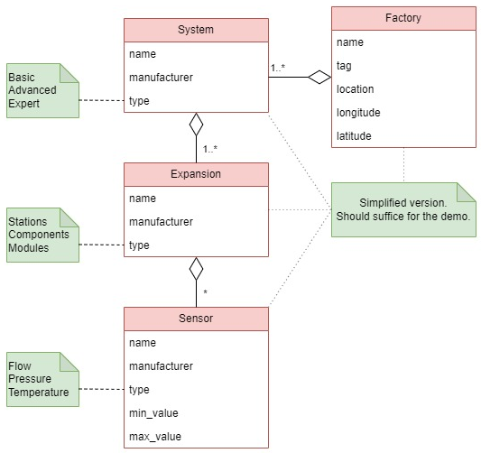

# Development

## Architecture and design

Describe the architecture and design of the system. Use component/deployment diagrams. If needed, resort to package diagrams to organize them into more manageable parts. 

Be clear about what is the current architecture/design and what is the one you envision in the future, in case they are different. 
Identify main risks and justify the most important choices to show the soundness of the architecture and design that you have implemented or plan to implement.

### First Prototype - Sprint 0

The architecture of the first prototype can be seen [here](product.md#domain-analysis).

We decided to use Docker to create the containers for the databases, the python instance and Grafana. This way, we can easily deploy the system in any machine that has docker installed.

## Technology

### First Prototype - Sprint 0

At first, after the first contact with the client, we were told we were free to use any technology we wanted, as long as it doesn't require a lot of maintenance and it is open-source. With this in mind, we decided to use the following technologies, languages and frameworks:

- **Docker**: Docker was used to create the containers for the databases and the python instance. This way, we can easily deploy the system in any machine that has docker installed.

- **Python**: Python was used to create the python instance that simulates the data from the sensors and sends it to the databases. It was also used to create the **Flask** server that exposes the data from the sensors to the **Prometheus** database. For this first prototype, it was also used to generate the data from the sensors and the static data from the systems.

- **PostgreSQL**: PostgreSQL was used to create the database that holds the static data from the systems. This data is used to create the factories, systems, expansions and the sensors. It also holds the thresholds values of the sensors. This technology was chosen because it is open-source, easy to use, and it is one of the most used databases in the world for Relational Database Management System (RMDBS).

- **Flask**: Flask was used to create the server that exposes the data from the sensors to the **Prometheus** database. This choice was made because it is a micro web framework written in Python, and it is very easy to use and to integrate with other technologies. This server exposes the data via HTTP, so that Prometheus can scrape it at a given interval.

- **Prometheus**: Prometheus was used to create the database that holds the data from the sensors. It is used to create the graphs and the alerts. Prometheus scrapes the data that the python instance generated and sent to the **Flask** server.

- **Grafana**: Grafana analytics & monitoring tool was used to display the data and collected metrics to the final user. It shows them via dashboards, and also displays alerts when they are triggered. The Grafana instance queries both the **Prometheus** and the **PostgreSQL** databases on a given interval and dashboard load, respectively. The user can manipulate the queries that are sent in an intuitive way, so that he can filter the data that he wants to see. From here, the user can also trigger any action through the outside systems, just like turning off a system.

The domain of the architecture can be seen [here](product.md#domain-analysis).

### Second Prototype - To be done in the following Sprints

After the first prototype, we had a Q&A session with the client which enlightened us on some of the requirements that we had to implement. With this in mind, we decided to change some of the technologies that we were using, and also add some new ones. The technologies that we decided to use were the following:

- **Docker**: Docker was used to create the containers for the databases and the python instance. This way, we can easily deploy the system in any machine that has docker installed. This technology was chosen because it is open-source, easy to use, and it is one of the most used technologies in the world for containerization.

- **Python**: Python was used to create the python instance that simulates the data from the sensors and sends it to the databases once more, while we do not have the real data from the sensors. It was also used to create the **Flask** server that exposes the data from the sensors to the **Prometheus** database. For this second prototype, it was also used to generate the data from the sensors and the static data from the systems.

- **PostgreSQL**: PostgreSQL was used to create the database that holds the static data from the systems. This data is used to create the factories, systems, expansions and the sensors. It also holds the thresholds values of the sensors. It is open-source, easy to use, and it is one of the most used databases in the world for Relational Database Management System (RMDBS). We also had the option to choose a **MongoDB** database, which is a document database. This means that PostgreSQL is more suitable for the static data, since it is more structured and achieves an higher confidence level to integrate with Grafana, while MongoDB is more suitable for the simulations data that the **MLM** will generate, since it is more flexible and can handle the data in a more efficient way. For now, we will stick with PostgreSQL, since it is the most used system for this purpose and has an easier integration with Grafana.

- **Prometheus**: Prometheus was used to create the database that holds the data from the sensors. It is used to create the graphs and the alerts. Prometheus scrapes the data that the python instance generated and sent to the **Flask** server. We had the option to choose a **InfluxDB** database, which is also a time series database. Both instances achieve the main purpose, but the pros of on system are the cons of the other. Prometheus has a built-in alert system, while InfluxDB has a built-in MQTT handler. While this has to be discussed with the client further, we decided to use Prometheus for the second prototype, since it is the most used system for this purpose and has an easier integration with Grafana.

- **Eclipse Mosquitto**: Eclipse Mosquitto was used to create the MQTT broker that receives all the data from the sensors via the MQTT protocol. It is responsible for sending the data to the EdgeX Foundry instance. This technology was chosen because it is open-source, easy to use, and it is one of the most used technologies in the world for MQTT brokers. We also had the option to choose **EMQX**, which is also a MQTT broker. Both instances achieve the main purpose, but we decided to keep with **Eclipse Mosquitto** since it has an easier integration with EdgeX Foundry.

- **DINASORE**: DINASORE is a distributed platform that enables reconfiguration of Cyber-Physical System (CPS). The DINASORE platform allows the implementation of python Function Block (FB) based pipelines for sensor integration, data processing, and systems control. It is also equipped to reach the product's goal of being an Industry 4.0 application, as it uses the OPC-UA protocol to allow communication with the other industrial components. While not our first choice for a pipelining technology, it was requested by the client to be used at sensor-level. 

- **PyTorch**: PyTorch was used to create the **MLM** that is responsible for the prediction of the sensors data. This technology was chosen because it is open-source, easy to use, and it is one of the most used technologies in the world for machine learning models. We had more options to choose from, but for now, we will stick with PyTorch, since it will achieve our main purpose.

- **Grafana**: Grafana analytics & monitoring tool was used to display the data and collected metrics to the final user. It shows them via dashboards, and also displays alerts when they are triggered. The Grafana instance queries both the **Prometheus** and the **PostgreSQL** databases on a given interval and dashboard load, respectively. The user can manipulate the queries that are sent in an intuitive way, so that he can filter the data that he wants to see. From here, the user can also trigger any action through the outside systems, just like turning off a system. This technology was chosen because it is open-source, easy to use, and it is one of the most used technologies in the world for analytics & monitoring tools. Also, some developers have previous experience with the tool.

The domain of the architecture can be seen [here](product.md#domain-analysis).

##  Development guide

In this section you can find a comprehensive guide on how to fully setup a production-ready environment with all the needed features to start contributing.

### Requirements

- [Docker](https://www.docker.com/) or [Docker Desktop](https://www.docker.com/products/docker-desktop/)
- [Python 3](https://www.python.org/downloads/) (At least version 3.8)
- [pip](https://pip.pypa.io/en/stable/installing/)

### Installation / Setup

First of all, make sure you are in the `src` directory of the project.

If you are running **Windows**, you can use the `install.bat` script. Otherwise, if you are using **Linux**, you can use the `install.sh` script.

(If your python is tagged as `python3` instead of `python`, you will need to change the scripts accordingly)

This will install the necessary python packages and create the necessary docker containers, those being:
- `Grafana` running under the port `3000`;
- `pgAdmin` running under the port `4321`;
- `PostgreSQL` running under the port `5432`;
- `Prometheus` running under the port `9090`;
- `Flask` running under the port `8000`.

The script will populate the `PostgreSQL` database with the necessary tables and data after the containers are up and running.

Currently, the data generator script is not running, so the data in the database is going to be the same across the board, but you can remove the comment from the `data_generator()` function on the `main.py` file to produce fresh data.

The generated data consists of 3 facilities. Each facility has 5-10 systems. Each system has 2-5 expansions, and each expansion 1-2 sensors.

The idea for the SQL structure was taken from [here](https://www.festo.com/net/SupportPortal/Files/492858/Poster_DINA2_I4o_Solutions_205x292_EN_screen.pdf) and [here](https://www.festo.com/us/en/e/technical-education/educational-concepts/highlights/learning-factories/mps-mechatronics-learning-factories-id_31963/).


The following images shows the schematic of the system and the database representation:




### Usage

#### pgAdmin

PgAdmin is a web interface for `PostgreSQL`. It will be essential to test your queries and to see the data in the database before using it in the `Grafana` dashboard.

To access the `pgAdmin` interface, go to `localhost:4321` and login with the following credentials:
```markdown
**Email**: postgres@pg.pg
**Password**: postgres
```

Then, add a new server with the following credentials:
```markdown
**Host name/address**: postgres  *(Under the docker network the hosts take the name you give them in the docker-compose file, instead of localhost)*
**Port**: 5432
**Maintenance database**: postgres
**Username**: postgres
**Password**: postgres
```


#### PostgreSQL

If you rather, you can use the `psql` command to access the database. To do so, you need to access the `PostgreSQL` container through docker and run the `psql` command. You can do this by running the following command:
```bash
docker exec -it postgres psql -U postgres
```

You can use the file `data/push_to_db.py` to push data to the database.

Note: If you are having problems (for example, have postgres also installed on your machine), you can push the data manually on the `pgAdmin` interface through the `Query Tool` tab.

#### Flask

The `Flask` server will query the `PostgreSQL` database and expose the data under `localhost:8000/metrics` for `Prometheus` to scrape. This data contains the generated value for each sensor in the database, that is being updated every few seconds.

You can enter the url in your browser to see the data that is being sent to `Prometheus`.

#### Prometheus

To access the `Prometheus` interface, go to `localhost:9090`. 

To verify if the data is being scraped from the `Flask` server, go to the `Status > Targets` tab and check if the `sensor-job` is up and running. If it is, it should show `UP` under the `State` column.

On the `Expression` tab, you can enter a query to verify the data that is being scraped from the `Flask` server. For example, you can enter the following query:
```sql
sensor_value
-- or
sensor_value{sensor_id="1"}
```
The first one will show all the sensors data, while the second one will only show the value of the sensor with id `1`.

#### Grafana

To access the `Grafana` interface, go to `localhost:3000`. Login with the following credentials:
```markdown
**Username**: admin
**Password**: admin
```

After logging in, you will be prompted to change the password, but you can skip it. After that, you will be redirected to the `Home Dashboard`.

From there, select on the left side the `Dashboards` tab. This will show the available dashboards folders. Select the `General` folder and then select the `General View` dashboard. 


Note: If you wish to change the existing dashboards, that won't be possible because they are provisioned. You can import the same dashboards, that are stored under `grafana/provisioning/dashboards/general`, and change them as you wish. 

### Post

If you want to create your own dashboard, you can use the Grafana's built-in tools, but you are free to use plugins to achieve your desired needs. I recommend the following plugins:
- [Apache ECharts](https://grafana.com/grafana/plugins/volkovlabs-echarts-panel/). You can use the [Apache Echarts Playground](https://echarts.apache.org/examples/en/index.html) to tryout the different charts and see the code behind them;
- [Data Manipulation Plugin](https://grafana.com/grafana/plugins/volkovlabs-form-panel/);
- [Variable Panel](https://grafana.com/grafana/plugins/volkovlabs-variable-panel/);
- [Canvas Panel](https://grafana.com/docs/grafana/latest/panels-visualizations/visualizations/canvas/).

To install any plugin, you need to access the Grafana's terminal through docker and run the install command for the plugin you want, following by a restart of the Grafana server.

Also, [here](https://play.grafana.org/dashboards) you can find some examples.

## Security concerns

Identify potential security vulnerabilities classes and explain what the team has done to mitigate them.


## Quality assurance

Describe which tools are used for quality assurance and link to relevant resources. Namely, provide access to reports for coverage and mutation analysis, static analysis, and other tools that may be used for QA.


## Metrics

Describe how you captured each of the "four key metrics" (e.g., automatic mechanism, survey to the team on the end of each sprint).

Provide here an historical record (for each sprint) of the four key metrics and velocity.


## Restrospectives

### **Sprint 1 (12 October - 26 October)**

#### Project Retrospective

#### Team 1 Retrospective
For the first sprint, our team's objectives were to create a database suitable for static and real-time data, setup Grafana, design and implement a page that allows workers to view machine logs and characteristics, and we were also responsible ([João Araújo](../factsheets/team1/joao_araujo.md)) with helping other team members. In conclusion, we were able to do most tasks, but work still needs to be done.

#### Team 2 Retrospective
Our team's main objective this first sprint was familiarizing ourselves with the DINASORE technology and its requirements for a full and thorough implementation in our project. For this sprint, we worked in conjunction with [João Araújo](../factsheets/team1/joao_araujo.md) throughout the whole process. Overall, the team exceeded expectations in not only understanding the technology at hand but also in its partial integration in the main codebase. Documentation and a setup guide were also written. Furthermore, the client's feedback was fully positive, which also confirmed the direction in which the team was headed.

#### Team 3 Retrospective
During this sprint, our team was assigned the task of developing automatic notifications for events and familiarising with the way they work and are implemented in the Grafana platform. Although we were able to achieve this goal successfully, creating some test notifications, as data was still not dynamic, in large quantity and following a defined pipeline, we were not able to fully develop and test this feature. In conclusion, we acquired all the necessary knowledge to finish this task in the next sprint alongside another task assigned to us, as the work done by the other teams regarding the stream of data will support our development of this feature.

#### Team 4 Retrospective

#

### **Sprint 2**

#

### **Sprint 3**

#

### **Sprint 4**


