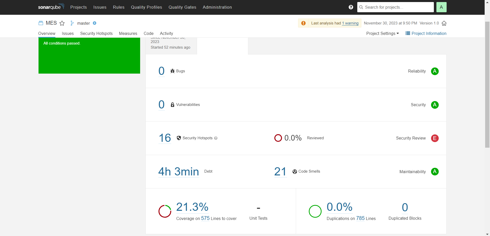

# Development

## Architecture and design

Describe the architecture and design of the system. Use component/deployment diagrams. If needed, resort to package diagrams to organize them into more manageable parts.

Be clear about what is the current architecture/design and what is the one you envision in the future, in case they are different.
Identify main risks and justify the most important choices to show the soundness of the architecture and design that you have implemented or plan to implement.

### First Prototype - Sprint 0

The architecture of the first prototype can be seen [here](product.md#domain-analysis).

We decided to use Docker to create the containers for the databases, the python instance and Grafana. This way, we can easily deploy the system in any machine that has docker installed.

## Technology

### First Prototype - Sprint 0

At first, after the first contact with the client, we were told we were free to use any technology we wanted, as long as it doesn't require a lot of maintenance and it is open-source. With this in mind, we decided to use the following technologies, languages and frameworks:

- **Docker**: Docker was used to create the containers for the databases and the python instance. This way, we can easily deploy the system in any machine that has docker installed.

- **Python**: Python was used to create the python instance that simulates the data from the sensors and sends it to the databases. It was also used to create the **Flask** server that exposes the data from the sensors to the **Prometheus** database. For this first prototype, it was also used to generate the data from the sensors and the static data from the systems.

- **PostgreSQL**: PostgreSQL was used to create the database that holds the static data from the systems. This data is used to create the factories, systems, expansions and the sensors. It also holds the thresholds values of the sensors. This technology was chosen because it is open-source, easy to use, and it is one of the most used databases in the world for Relational Database Management System (RMDBS).

- **Flask**: Flask was used to create the server that exposes the data from the sensors to the **Prometheus** database. This choice was made because it is a micro web framework written in Python, and it is very easy to use and to integrate with other technologies. This server exposes the data via HTTP, so that Prometheus can scrape it at a given interval.

- **Prometheus**: Prometheus was used to create the database that holds the data from the sensors. It is used to create the graphs and the alerts. Prometheus scrapes the data that the python instance generated and sent to the **Flask** server.

- **Grafana**: Grafana analytics & monitoring tool was used to display the data and collected metrics to the final user. It shows them via dashboards, and also displays alerts when they are triggered. The Grafana instance queries both the **Prometheus** and the **PostgreSQL** databases on a given interval and dashboard load, respectively. The user can manipulate the queries that are sent in an intuitive way, so that he can filter the data that he wants to see. From here, the user can also trigger any action through the outside systems, just like turning off a system.

The domain of the architecture can be seen [here](product.md#domain-analysis).

### Second Prototype - To be done in the following Sprints

After the first prototype, we had a Q&A session with the client which enlightened us on some of the requirements that we had to implement. With this in mind, we decided to change some of the technologies that we were using, and also add some new ones. The technologies that we decided to use were the following:

- **Docker**: Docker was used to create the containers for the databases and the python instance. This way, we can easily deploy the system in any machine that has docker installed. This technology was chosen because it is open-source, easy to use, and it is one of the most used technologies in the world for containerization.

- **Python**: Python was used to create the python instance that simulates the data from the sensors and sends it to the databases once more, while we do not have the real data from the sensors. It was also used to create the **Flask** server that exposes the data from the sensors to the **Prometheus** database. For this second prototype, it was also used to generate the data from the sensors and the static data from the systems.

- **PostgreSQL**: PostgreSQL was used to create the database that holds the static data from the systems. This data is used to create the factories, systems, expansions and the sensors. It also holds the thresholds values of the sensors. It is open-source, easy to use, and it is one of the most used databases in the world for Relational Database Management System (RMDBS). We also had the option to choose a **MongoDB** database, which is a document database. This means that PostgreSQL is more suitable for the static data, since it is more structured and achieves an higher confidence level to integrate with Grafana, while MongoDB is more suitable for the simulations data that the **MLM** will generate, since it is more flexible and can handle the data in a more efficient way. For now, we will stick with PostgreSQL, since it is the most used system for this purpose and has an easier integration with Grafana.

- **Prometheus**: Prometheus was used to create the database that holds the data from the sensors. It is used to create the graphs and the alerts. Prometheus scrapes the data that the python instance generated and sent to the **Flask** server. We had the option to choose a **InfluxDB** database, which is also a time series database. Both instances achieve the main purpose, but the pros of on system are the cons of the other. Prometheus has a built-in alert system, while InfluxDB has a built-in MQTT handler. While this has to be discussed with the client further, we decided to use Prometheus for the second prototype, since it is the most used system for this purpose and has an easier integration with Grafana.

- **Eclipse Mosquitto**: Eclipse Mosquitto was used to create the MQTT broker that receives all the data from the sensors via the MQTT protocol. It is responsible for sending the data to the EdgeX Foundry instance. This technology was chosen because it is open-source, easy to use, and it is one of the most used technologies in the world for MQTT brokers. We also had the option to choose **EMQX**, which is also a MQTT broker. Both instances achieve the main purpose, but we decided to keep with **Eclipse Mosquitto** since it has an easier integration with EdgeX Foundry.

- **DINASORE**: DINASORE is a distributed platform that enables reconfiguration of Cyber-Physical System (CPS). The DINASORE platform allows the implementation of python Function Block (FB) based pipelines for sensor integration, data processing, and systems control. It is also equipped to reach the product's goal of being an Industry 4.0 application, as it uses the OPC-UA protocol to allow communication with the other industrial components. While not our first choice for a pipelining technology, it was requested by the client to be used at sensor-level.

- **PyTorch**: PyTorch was used to create the **MLM** that is responsible for the prediction of the sensors data. This technology was chosen because it is open-source, easy to use, and it is one of the most used technologies in the world for machine learning models. We had more options to choose from, but for now, we will stick with PyTorch, since it will achieve our main purpose.

- **Grafana**: Grafana analytics & monitoring tool was used to display the data and collected metrics to the final user. It shows them via dashboards, and also displays alerts when they are triggered. The Grafana instance queries both the **Prometheus** and the **PostgreSQL** databases on a given interval and dashboard load, respectively. The user can manipulate the queries that are sent in an intuitive way, so that he can filter the data that he wants to see. From here, the user can also trigger any action through the outside systems, just like turning off a system. This technology was chosen because it is open-source, easy to use, and it is one of the most used technologies in the world for analytics & monitoring tools. Also, some developers have previous experience with the tool.

The domain of the architecture can be seen [here](product.md#domain-analysis).

## Development Guide

To find a comprehensive guide on how to fully setup a production-ready environment with all the needed features to start contributing, please refer to the [Development Guide sheet](./development/development_guide.md).

## Security Concerns

For security-related questions regarding the project and respective testing logs, please refer to the [Security Concerns sheet](./development/security_concerns.md).

## Quality Assurance

For an explanation pertaining the project's quality assurance, please refer to the [Quality Assurance sheet](./development/quality_assurance.md).

### Sonarqube

To access the `Sonarqube` interface, go to `localhost:9000`. Login with the following credentials:
```markdown
**Username**: admin
**Password**: admin
```

After logging in, change the password. You will be redirected to the `projects` page.


The next step is to create a new project. For that, click on the `Add a project` button. Select the manual option, and give your project a name and project key. In this case, name it `MES`.


Afterward, you will be prompted to generate a token. We will name it `MES_Analysis`.


To generate the best command for the scanner, customize your environment and the system you are running.

Follow the instructions on the screen to configure the scanner.


Finally, copy the command and run it on a terminal in the src folder of the project.

After scanning the files, you can check the results on the `Sonarqube` interface.



## Security concerns

As of the end of Sprint 2 (16/11/2023), there are no security concerns to be tackled. The project is mostly self-contained and doesn't need to handle any type of sensitive information or possible data leakage. However, with _Sonarqube_, possible security vulnerabilities are scanned every time changes to the project's code occur, and this, this section is subject to change as more features are implemented.

### SonarQube - Latest scan on branch `main` 

The Sonar scanner indicates no vulnerabilities, providing an A-grade security rating. Nonetheless, it highlights 25 security hotspots, which, while not categorized as vulnerabilities, are flagged as security concerns requiring manual assessment.


## Quality assurance

Continuous Integration (CI) tools are currently set in place to ensure correct codebase management and consistency. In terms of static analysis, code is scanned using linters everytime a PR wants to commit changed into the _main_ branch. Furthermore, a [SonarQube](https://www.sonarsource.com/products/sonarqube/?gads_campaign=SQ-Mroi-PMax&gads_ad_group=Global&gads_keyword=&gad_source=1&gclid=CjwKCAiAu9yqBhBmEiwAHTx5pxnFfXXnEDXFcodcgZRO5zP1ALPlJ4zaqIEvecU6Sz8-9v2VsiagzxoCHjUQAvD_BwE) environment was setup, giving us access to more code analysis and extensive reports about bugs, security and vulnerabilities. Moreover, a [Bandit](https://bandit.readthedocs.io/en/latest/config.html#bandit-settings) workflow was implemented for different types of tests. The several available tests are [here](https://bandit.readthedocs.io/en/latest/plugins/index.html).
The Continuous Integration linter is complaining, however, about some default formatting of the DINASORE blocks (source code for the DINASORE technology, which should not be changed), which can cause problems in the future.

### SonarQube - Latest scan on branch `main`

The Sonar scanner reports a 6.2% code duplication. Additionally, it falsely suggests a 0.0% code coverage, despite the presence of tests in the project. This discrepancy arises from the scanner's current lack of configuration to detect coverage, an issue to be solved in the next sprint. Regarding code smells, the scanner identifies 79 instances but assigns an A-grade rating for maintainability. In terms of reliability, the scanner points out 2 bugs.


## Metrics
>>>>>>> 69a2593 (docs: adds bandit description)

## Metrics (10/10)
For every sprint, the following process metrics are being recorded:

| Sprint | Deployment Frequency | MTTR | Lead Time | Change Failure Rate |
|-------------|-------------|-------------|-------------|-------------|
| 0 | - | - | - | - | 
| 1 | - | - | - | - | 
| 2 | one every two days | 3 hours | 2 weeks | 20% | 
| 3 |   |   |   |   | 
| 4 |   |   |   |   |

| Sprint | Velocity (T1) | Velocity (T2) | Velocity (T3) | Velocity (T4) | Velocity (Product) |
|-------------|-------------|-------------|-------------|-------------|-------------|
| 0 | 0 | 0 | 0 | 0 | 0 |
| 1 | 8 | 8 | 0 | 2 | 18 |
| 2 | 10 | 3 | 1 | 0 | 13 |
| 3 | 6 | 7 | 0 | - | 13 |
| 4 | - | - | - | - | - |

## Team Retrospectives

The team's individual and overall retrospectives are present in the [Team Retrospectives sheet](../factsheets/retrospectives.md).
