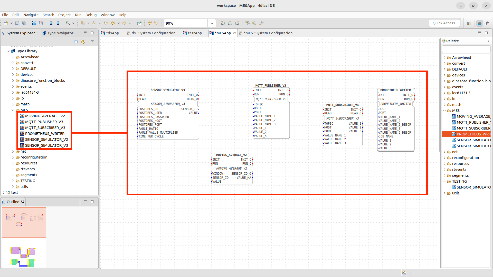
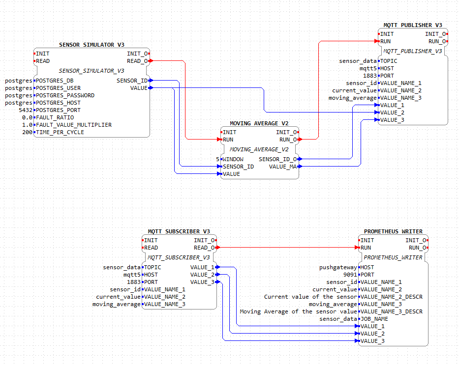
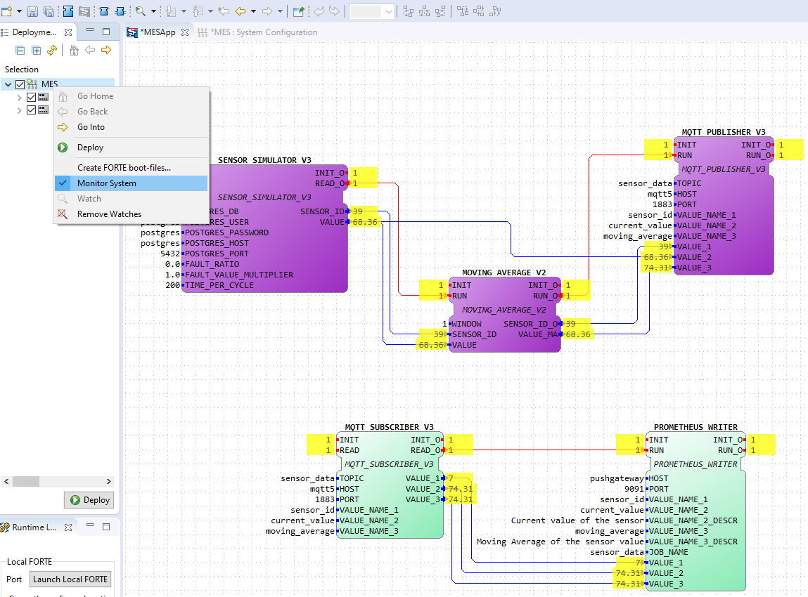

# Development Guide

In this section you can find a comprehensive guide on how to fully setup a production-ready environment with all the needed features to start contributing.

## Requirements

- [Docker](https://www.docker.com/) or [Docker Desktop](https://www.docker.com/products/docker-desktop/). This will be used to containerize the different services used in the project.

- [Python 3](https://www.python.org/downloads/) (At least version 3.8). This is required to run the data generator and to push this data to the **PostgreSQL** database.

- [pip](https://pip.pypa.io/en/stable/installing/). This is required to install the python packages.

- Install 4DIAC-IDE for your system. This will be used to configure the dataflow pipeline. You can install using any of these permalinks:

  - [4diac IDE 1.11.0 Windows 64-bit](http://www.eclipse.org/downloads/download.php?file=/4diac/releases/1.11/4diac-ide/4diac-ide-incubation_1.11.0-win32.win32.x86_64.zip)
  - [4diac IDE 1.11.0 Linux 64-bit](http://www.eclipse.org/downloads/download.php?file=/4diac/releases/1.11/4diac-ide/4diac-ide-incubation_1.11.0-linux.gtk.x86_64.tar.gz)
  - [4diac IDE 1.11.0 Mac OS X](http://www.eclipse.org/downloads/download.php?file=/4diac/releases/1.11/4diac-ide/4diac-ide-incubation_1.11.0-macosx.cocoa.x86_64.dmg)

  **NOTE**: In case the permalinks get outdated, you can install using the from this [online folder](https://drive.google.com/drive/folders/1BG9jSN6q5V6J5MTj7w3r6gF6OH6iEOvm)

  **NOTE**: For more details about the 4DIAC-IDE, check this [link](https://eclipse.dev/4diac/en_help.php?helppage=html/4diacIDE/overview.html).

  **NOTE**: After instalation, ensure you have the 4DIAC-IDE outside of the root of this project, otherwise it will be submited to git.

- (Optional for now) Install [Prosys OPC UA Browser 4.4.0-126](https://www.prosysopc.com/products/opc-client/). This OPC client can be used to observe the results of the OPC UA server built in DINASORE.

## Installation / Setup

- First of all, make sure you are in the `/src` directory of the project.

- If you are running **Windows**, you can use the `install.bat` script. Otherwise, if you are using **Linux** or **Mac OS**, you can use the `install.sh` script.

- This will install the necessary python packages and create the necessary docker containers, those being:

  - `Grafana` running under the port `3000`;
  - `pgAdmin` running under the port `4321`;
  - `PostgreSQL` running under the port `5432`;
  - `Prometheus` running under the port `9090`;
  - `Prometheus Pushgateway` running under the port `9091`.
  - `Mosquitto MQTT Broker` running under the port `1883`.
  - `Dinasore (instance 1)` running under the port `61499` and `4840`.
  - `Dinasore (instance 2)` running under the port `61500` and `4841`.

  The script will populate the `PostgreSQL` database with the necessary tables and data after the containers are up and running. Also generates fresh new data to be used overall.

  The generated data consists of 3 facilities. Each facility has 5-10 systems. Each system has 2-5 expansions, and each expansion 1-2 sensors. From here, a system can have 3 different tasks associated and it is generated, for 24h, the distribution of tasks for each system. Tasks can also have gaps between them, which means that a system can be idle for a certain amount of time.

## Usage

### pgAdmin

PgAdmin is a web interface for `PostgreSQL`. It will be essential to test your queries and to see the data in the database before using it in the `Grafana` dashboard.

To access the `pgAdmin` interface, go to `localhost:4321` and login with the following credentials:

```markdown
**Email**: postgres@pg.pg
**Password**: postgres
```

Then, add a new server with the following credentials:

```markdown
**Host name/address**: postgres _(Under the docker network the hosts take the name you give them in the docker-compose file, instead of localhost)_
**Port**: 5432
**Maintenance database**: postgres
**Username**: postgres
**Password**: postgres
```


### PostgreSQL

If you rather, you can use the `psql` command to access the database. To do so, you need to access the `PostgreSQL` container through docker and run the `psql` command. You can do this by running the following command:

```bash
docker exec -it postgres psql -U postgres
```

You can use the file `data/push_to_db.py` to push data to the database.

Note: If you are having problems (for example, have postgres also installed on your machine), you can push the data manually on the `pgAdmin` interface through the `Query Tool` tab.

### Prometheus

To access the `Prometheus` interface, go to `localhost:9090`.

To verify if the data is being scraped from the `Pushgateway` server, go to the `Status > Targets` tab and check if the `pushgateway` is up and running. If it is, it should show `UP` under the `State` column.

On the `Expression` tab, you can enter a query to verify the data that is being scraped. For example, you can enter the following queries:

```sql
sensor_value
-- or
sensor_value{sensor_id="1"}
-- or
moving_average{sensor_id="1"}
```

The first one will show all the sensors data, while the second one will only show the value of the sensor with id `1`.

### Grafana

To access the `Grafana` interface, go to `localhost:3000`. Login with the following credentials:

```markdown
**Username**: admin
**Password**: admin
```

After logging in, you will be prompted to change the password, but you can skip it. After that, you will be redirected to the `Home Dashboard`.

From there, select on the left side the `Dashboards` tab. This will show the available dashboards folders. Select the `General` folder and then select the `General View` dashboard.


Now, you can play around with the variables and see the data in the dashboard.

Note: If you wish to change the existing dashboards, that won't be possible because they are provisioned. You can import the same dashboards, that are stored under `grafana/provisioning/dashboards/general`, and change them as you wish.

If you want to create your own dashboard, you can use the Grafana's built-in tools, but you are free to use plugins to achieve your desired needs. The following plugins are recommended:

- [Apache ECharts](https://grafana.com/grafana/plugins/volkovlabs-echarts-panel/). You can use the [Apache Echarts Playground](https://echarts.apache.org/examples/en/index.html) to tryout the different charts and see the code behind them;
- [Data Manipulation Plugin](https://grafana.com/grafana/plugins/volkovlabs-form-panel/);
- [Variable Panel](https://grafana.com/grafana/plugins/volkovlabs-variable-panel/);
- [Canvas Panel](https://grafana.com/docs/grafana/latest/panels-visualizations/visualizations/canvas/).

To install any plugin, you need to access the Grafana's terminal through docker and run the install command for the plugin you want, following by a restart of the Grafana server.

Also, [here](https://play.grafana.org/dashboards) you can find some examples.

### MQTT Broker

The `Mosquitto MQTT Broker` is running under `localhost:1883`, with the service open to receive connections from outside the docker network, such as the sensor simulator.

### 4DIAC-IDE

To open the 4DIAC-IDE, go to the folder where you installed it and run the `4diac-ide.exe` file.

In order to run the sensor simulator, you have to run DINASORE on your system. For that, you need to run the following commands:

```sh
# Move to the dinasore's root folder
cd src/dinasore

# Default values:
# <ip_address>=localhost, <port_diac>=61499,
# <port_opc>=4840, <log_level>=ERROR,
# <number_samples>=5, <seconds_per_sample>=20
python core/main.py -a <ip_address> \
                    -p <port_diac> \
                    -u <port_opc> \
                    -l <log_level> \
                    -m <number_samples> <seconds_per_sample>

```

**NOTE**: For Mac and Linux users, run with the flag -B to avoid the creation of cache folders (conflicts with the FBs folders): `python -B core/main.py`

For this project, we need to run two instances of DINASORE, one for the FORTE_PC and another for the FORTE_PC_1. For that, you need to run the following commands:

```sh
# On the first terminal

python core/main.py

# And on another terminal

python core/main.py -p 61500 -u 4841
```

- Now, you can open the 4DIAC-IDE and import the [function blocks folder](./resources/function_blocks/). For that, you can follow the next steps:

  1. Open the 4DIAC-IDE
  2. Go to File -> New -> New System -> *Name the project as *MES\*\*\* -> Finish
  3. On the System Explorer, left click to open the **MES** -> Right click on the **Type Library** -> Import -> General -> File System -> Next -> Browse -> Select the [function blocks folder](./resources/function_blocks/) -> Finish
  4. On the System Explorer, open **System Configuration** (**1**). Now add 2 FORTE_PC (**2**) and 1 Ethernet (**3**). Link the Forte PCs to the Ethernet (**4**). Update the port of the second FORTE_PC to 61500 (**5**).

     

  5. On the System Explorer, open **MESApp**
  6. From the palette on the right side, drag the following function blocks:

     - **SENSOR_SIMULATOR_V2**
     - **MOVING_AVERAGE_V2**
     - **MQTT_PUBLISHER_V3**
     - **MQTT_SUBSCRIBER_V3**
     - **PROMETHEUS_WRITER**

     

  7. Now, proceed to link the function blocks and fill the parameters with:

     - **SENSOR_SIMULATOR_V2**: OFFSET = 0. You can twist this value to emulate, for example, a sensor that can overheat (Offset = 10) or a sensor that is working above the desired temperature (Offset = -10).
     - **MOVING_AVERAGE_V2**: WINDOW = 5. This value is the number of samples that the moving average will use to calculate the average value. You can change this value to see how the moving average changes.
     - **MQTT_PUBLISHER_V3**:
       - TOPIC = "sensor_data". This is the topic that the publisher will use to publish sensor data to.
       - HOST = "localhost". This is the IP address of the MQTT Broker on your machine.
       - PORT = 1883. This is the port of the MQTT Broker on your machine.
       - VALUE_NAME_1 = "sensor_id". This is the id of the sensor.
       - VALUE_NAME_2 = "current_value". This is the current value of the sensor.
       - VALUE_NAME_3 = "moving_average". This is the moving average of the sensor.
     - **MQTT_SUBSCRIBER_V3**:
       - TOPIC = "sensor_data". This is the topic that the subscriber will use to subscribe to.
       - HOST = "localhost". This is the IP address of the MQTT Broker on your machine.
       - PORT = 1883. This is the port of the MQTT Broker on your machine.
       - VALUE_NAME_1 = "sensor_id". This is the id of the sensor.
       - VALUE_NAME_2 = "current_value". This is the current value of the sensor.
       - VALUE_NAME_3 = "moving_average". This is the moving average of the sensor.
     - **PROMETHEUS_WRITER**:
       - HOST = "localhost". This is the IP address of the Prometheus Gateway running on docker.
       - PORT = 9091. This is the port of the Prometheus Gateway running on docker.
       - VALUE_NAME_1 = "sensor_id". This is the id of the sensor.
       - VALUE_NAME_2 = "current_value". This is the current value of the sensor.
       - VALUE_NAME_2_DESCR = "Current value of the sensor". This is the description of the current value of the sensor.
       - VALUE_NAME_3 = "moving_average". This is the moving average of the sensor.
       - VALUE_NAME_3_DESCR = "Moving average of the sensor". This is the description of the moving average of the sensor.
       - JOB_NAME = "sensor_data". This is the job name of the sensor data.

     

     NOTE: Make sure to link the function blocks as shown in the image above. This step is important to ensure that the function blocks are linked in the correct order and that it follows the flow of the data.

  8. Link the function blocks to the corresponding FORTE_PC:

     - **SENSOR_SIMULATOR_V2**, **MOVING_AVERAGE_V2**, **MQTT_PUBLISHER_V3**: Right click on the function block -> Select "Map to .." -> Select "FORTE_PC" -> Select "EMB_RES"
     - **MQTT_SUBSCRIBER_V3**, **PROMETHEUS_WRITER**: Right click on the function block -> Select "Map to .." -> Select "FORTE_PC_1" -> Select "EMB_RES"

     

  9. Now the systems are ready for deploy. Change to the **Deploy View** (right corner icon or Window -> Perspective -> Open Perspective -> Deployment);

  10. Select your configuration and click Deploy to upload the configuration to the Smart Components;

      

  11. To monitor the system, change to the previous view, then right-click on the project folder, and select Monitor System. Now you can select which variables you want to monitor, for that right-click inside the variable and select Watch;

      

  12. To stop the monitoring process, right-click in the project folder and select Remove Watches and unselect Monitor System;

  13. If you want to reset each component, right-click in his name in the left bar and select Delete all Resources;

  14. Finally, to check the data structure or monitor the process using OPC-UA, you can use the [Prosys client](https://www.prosysopc.com/products/opc-client/), connecting to the component IP address at port 4840 and 4841.

# Coding Guidelines

## Regarding the Codebase

Patterns for **commits** will follow:
- **build**: *{description}*
- **chore**: *{description}*
- **docs**: *{description}*
- **feat**: *{description}*
- **fix**: *{description}*
- **perf**: *{description}*
- **refactor**: *{description}*
- **revert**: *{description}*
- **test**: *{description}*
- ...

The description should be a short sentence and should be written in the imperative, present tense: "change" not "changed" nor "changes". The first letter should not be capitalized, and there should be no dot (.) at the end.

The naming schema should follow this pattern and must not have default branches names (e.g. those generated by GitHub).

For each sprint, create a new branch from the dev branch, associated with the current sprint development you are going to do. If there is a need to change the **factsheets**, **sprint reviews** or other non relatable work files do it on the **documentation** branch directly. If you change something on your development and you need to document the changes on the markdown files, **DO** update it on the dev branch. Patterns for **branches** will follow:
- **build**/*{name}*
- **docs**/*{name}*
- **feat**/*{name}*
- **fix**/*{name}*
- **refactor**/*{name}*
- **test**/*{name}*
- ...

At the end of each sprint, the branches associated with dev and documentation will be merged into main, so the changes will appear on the deployment server, and the branches made for the sprint will be deleted.

When closing a **Pull Request**, add enough information so that reviewers and other users may see the changes done. Feel free to add text or even printscreens if it seems deemed. 

Reviews themselves shouldn't be done by the work group and verify if the branch it is merging into is the correct one.

**NOTE:** Be aware that any change or contribution to the project in general should be presented in the [Changelog](../../CHANGELOG.md) file for thorough project supervision.

## Regarding Team Retrospectives & Reviews

### Sprint Review

In the team's sprint review, outline the **tasks** your team was in charge of and explain their current status at the end of the sprint. Include, next to these, details on the **client's feedback** in relation to the work done by the team.

### Sprint Retrospective

There are many approaches to how to conduct a sprint retrospective: to further consistency throughout the project, it is recommended to use the [**Start, Stop, Continue**](https://www.betterup.com/blog/start-stop-continue) format.

# Staging, Production & Deployment

Both staging & production servers are hosted using [`Google Cloud`](https://cloud.google.com/)'s infrastructure. Both are running on [`Google Compute Engine`](https://cloud.google.com/compute), a *GCP* service that allows for creation and usage of remote Virtual Machines with differing levels of performance - presently, the machine type in usage is the *n2d-standard-2* because of the heavy weight of the containerized services the project employs.

To achieve effective deployment, the staging server is updated **every time** the *main* branch is updated, while the production server hosts only the releases made at the end of each sprint (NOTE: each release is tagged accordingly in the project's repository). Because of the [Github Action](https://github.com/google-github-actions/ssh-compute)'s faulty behaviour, a new work-around to ensure Continued Development is currently being worked on - at the minute, deployment is being made manually.

Currently, the project's production server is hosted at `http://34.42.26.53`, in which the Grafana dashboard is accessed [**here**](http://34.42.26.53:3000) and the Prometheus display [**here**](http://34.42.26.53:9090). As of this time, the current deployed version is the Sprint 3 release, adequately tagged on Github. 
