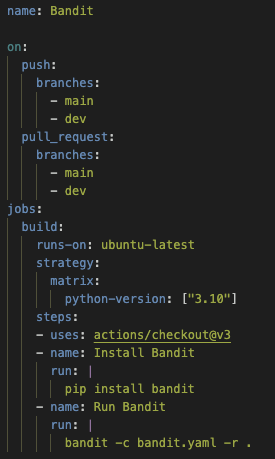

# Quality Assurance

Continuous Integration (CI) tools are currently set in place to ensure correct codebase management and consistency. In terms of static analysis, code is scanned using linters everytime a PR wants to commit changed into the _main_ branch. Furthermore, a [SonarQube](https://www.sonarsource.com/products/sonarqube/?gads_campaign=SQ-Mroi-PMax&gads_ad_group=Global&gads_keyword=&gad_source=1&gclid=CjwKCAiAu9yqBhBmEiwAHTx5pxnFfXXnEDXFcodcgZRO5zP1ALPlJ4zaqIEvecU6Sz8-9v2VsiagzxoCHjUQAvD_BwE) environment was setup, giving us access to more code analysis and extensive reports about bugs, security and vulnerabilities.
The Continuous Integration linter is complaining, however, about some default formatting of the DINASORE blocks (source code for the DINASORE technology, which should not be changed), which can cause problems in the future.

For the linters we also use [Pylint](https://pylint.pycqa.org/en/latest/user_guide/usage/run.html), which checks the code structure of the custom DINASORE blocks. This linter was altered so it could accept the default structure of DINASORE blocks without raising any exceptions.

Finally, the used package manager was configured using both [Pytest](https://docs.pytest.org/en/7.4.x/) and [Conda](https://docs.conda.io/en/latest/). The **environment.yml** file shows the several dependencies that will be used by Conda.

In the worflow .yml file, meanwhile, it was necessary to install all the project requirements, otherwise they wouldn't be recognised.

Moreover, a [Bandit](https://bandit.readthedocs.io/en/latest/config.html#bandit-settings) workflow was implemented for different types of tests. The several available tests are [here](https://bandit.readthedocs.io/en/latest/plugins/index.html). The workflow was configured to skip the default code of the chosen tecnologies, as well as irrelevant tests for our application, as we can see in the following files (.bandit and bandit.yaml, respectively):

Bandit workflow configuration file:

## SonarQube - Latest scan on branch `main`

The Sonar scanner reports a 6.0% code duplication. Additionally, the coverage report reveals a 3.2% code coverage. Regarding code smells, the scanner identifies 79 instances but assigns an A-grade rating for maintainability. In terms of reliability, the scanner points out 2 bugs.

Regarding code coverage, a lot of components that already came integrated with the DINASORE technology are not covered by tests. This is because the DINASORE technology is not supposed to be changed. If we only consider the implemented components, the coverage increases to 19.0%. The other statistics also improve.

