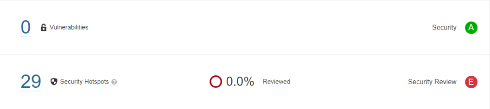

# Security Concerns

As of the end of Sprint 4 (19/12/2023), there are no security concerns to be tackled. The project is mostly self-contained and doesn't need to handle any type of sensitive information or possible data leakage. However, with _Sonarqube_, possible security vulnerabilities are scanned every time changes to the project's code occur, and this, this section is subject to change as more features are implemented.

## SonarQube - Latest scan on branch `main` 

The Sonar scanner indicates no vulnerabilities, providing an A-grade security rating. Nonetheless, it highlights 29 security hotspots, which, while not categorized as vulnerabilities, are flagged as security concerns requiring manual assessment.

