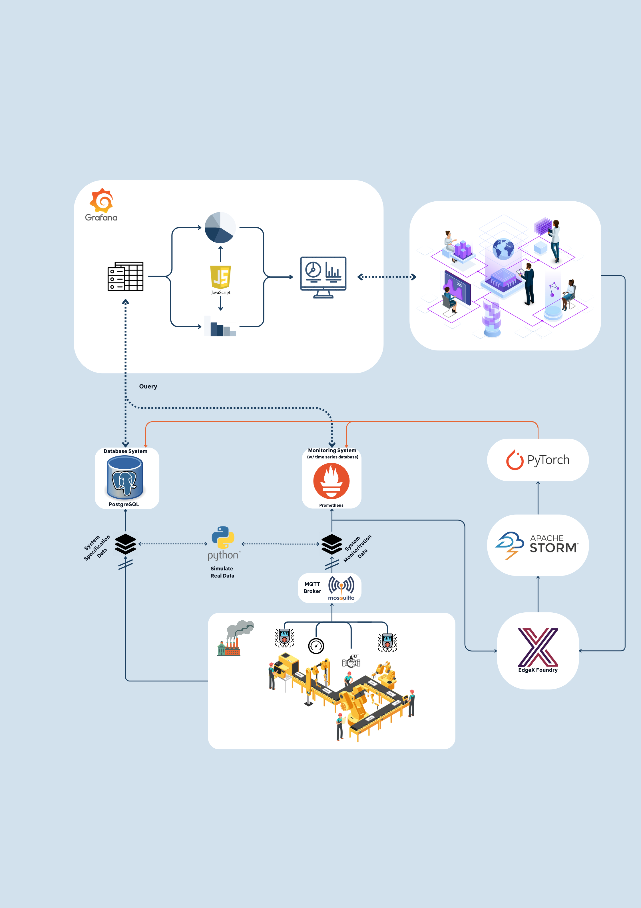

# Product Management

## Product Vision

We are on a mission to transform the way businesses operate and maintain their machinery, making it smarter, more efficient, and cost-effective.
Our vision is to empower machines with the ability to proactively monitor their own health, predict maintenance needs, and optimize their performance autonomously.
We believe that a smarter tomorrow begins with intelligent machines. By harnessing the power of artificial intelligence, machine learning, and the Internet of Things (IoT), our product empowers machines to make informed decisions, reduce downtime, and enhance productivity.
Key Pillars of Our Product Vision:
- *Autonomous Machine Intelligence:* We envision a world where machines autonomously monitor their condition, identify anomalies, and take corrective actions in real-time. This level of autonomy reduces human intervention and the risk of unplanned disruptions.
-  *Advanced Data Analytics:* Our product will provide a dedicated data analytics platform, enabling users to delve into production status, analyze trends, and access historical data. Informed decisions will be driven by a wealth of data insights.

By pursuing these pillars of our product vision, we aim to offer a holistic solution for industries seeking efficient machine monitoring and maintenance.

## Market Research

The following is a thorough survey of similar products and their pros and cons. The goal is to provide valuable insights into making an informed decision about our project and how to position it effectively in relation to our client.

### Siemens Manufacturing Execution System (Siemens MES)

**Pros:**
- Strong integration capabilities with Siemens PLCs and automation equipment.
- Robust real-time monitoring and data collection features.
- Extensive reporting and analytics functionalities.
- Well-established in various industries, making it a reliable choice for large enterprises.

**Cons:**
- Can be expensive to implement, especially for smaller organizations.
- Requires specialized Siemens hardware in some cases, limiting flexibility.

### Wonderware MES by AVEVA

**Pros:**
- Offers a comprehensive MES suite with modules for various functions.
- Good compatibility with a wide range of hardware and industrial equipment.
- Scalable from small to large-scale operations.
- Strong data visualization and analytics tools.

**Cons:**
- Licensing costs can be significant.
- Implementation and configuration can be complex.

### Rockwell Automation's FactoryTalk ProductionCentre

**Pros:**
- Excellent integration with Rockwell PLCs and control systems.
- Strong focus on production workflow management.
- Extensive support for predictive maintenance.
- User-friendly interface and reporting.

**Cons:**
- Primarily tailored for Rockwell hardware and may require adaptation for other equipment.
- Initial setup can be time-consuming.

### Epicor Mattec MES

**Pros:**
- Specialized in real-time monitoring and data collection for manufacturing processes.
- Easy integration with various industrial machines.
- Offers machine connectivity and IIoT capabilities.
- Provides robust reporting and analytics tools.

**Cons:**
- Primarily focused on real-time monitoring, may lack some advanced workflow management features.
- Costs may vary depending on the scale of implementation.

### Plex Systems MES

**Pros:**
- Cloud-based MES offering flexibility and scalability.
- Provides a comprehensive suite for MES functions.
- Strong data visualization, analytics, and reporting capabilities.
- Offers IIoT connectivity.

**Cons:**
- May not be suitable for organizations with strict data security requirements.
- Cost can add up over time with subscription-based pricing.

With this in mind, we can infer that our project should be based on open-source software, with low maintenance cost and high modularity and availability.

## Domain Analysis

### First Representation

According to the project guidelines, we achieved a consensus on the following domain analysis:

This diagram represents the main entities of our project and how it would be integrated towards the first Sprint. It shows the relation between the different entities and the data flows within them. The main entities are the following:

- **Factory**: The factory is the main entity of the project. It represents the factory where the production takes place. It has multiple systems, those containing multiple sensors attatched to it. The data from the sensors are fetched by the systems and sent to a central server (which we represented as a python instance).

- **Python Instance**: This istance, for the first part of the project, holds the data from the sensors (or should we say, it simulates it) and sends it to the databases.

- **Databases**: The present databases holds 2 types of data: the data from the sensors and the static data from the systems themselfs.

    - **PostgreSQL**: This database holds the static data from the systems. This data is used to create the factories themselfs, systems, expansions and the sensors. It also holds the thresholds values of the sensors.

    - **Prometheus**: This database holds the data from the sensors. It is used to create the graphs and the alerts. Prometheus scrapes the data that the python instance generated and sent to the **Flask** server. This flask server, exposes the data via HTTP, so that Prometheus can scrape it at a given interval.

- **Grafana**: Grafana is the tool that is used to display the metrics to the final user. It shows the metrics via dashboards, and also displays alerts when they are triggered. The Grafana instance queries both the **Prometheus** and the **PostgreSQL** databases on a given interval and dashboard load, respectively. The user can manipulate the queries that are sent in an intuitive way, so that he can filter the data that he wants to see. From here, the user can also trigger any action through the outside systems, just like turning off a system.

### Second Representation

After having the first representation of the domain model and the Q&A session with the client, we decided to change the domain model to the following:

Similar to the first representation, this diagram represents the main entities of our project and how it would be integrated towards the first Sprint. It shows the relation between the different entities and the data flows within them. The main entities are the following:

- **Factory**: The factory keeps being the main entity of the project. It represents the factory where the production takes place. It has multiple systems, those containing multiple sensors attatched to it. The data from the sensors are fetched by the systems and now are sent to a central MQTT broker.

- **MQTT Broker**: This broker receives all the data from the sensors via the MQTT protocol. It is responsible for sending the data to the EdgeX Foundry instance.

- **EdgeX Foundry**: This system is built on top of the MQTT broker, so it is responsible for the communication between the MQTT broker and the databases and the **M**achine **L**earning **M**odel (**MLM**). It is also responsible to retrieve data to the Apache Storm/Flink instance to process it and filter it.

- **Prometheus**: This database hold the data from the sensors. Prometheus has a built-in alert and graph system. Prometheus scrapes the data that the EdgeX Foundry instance has available.

- **PostgreSQL**: This database hold the static data from the systems. This data is used to create the factories themselfs, systems, expansions and the sensors. It also holds the thresholds values of the sensors. While PostgreSQL being a relational database, it is suitable for the static data, since it is more structured and achieves an higher confidence level to integrate with Grafana.

- **Apache Storm**: This systems is responsible for the data processing and the data filtering. It is also responsible for the communication between the databases and the **MLM**.

- **Machine Learning Model**: This model is responsible for the prediction of the sensors data. We will use most likely **PyTorch** to build and train it. The results of a prediction will be sent to the **Apache Storm** instance, so that it can be processed and filtered or it can be sent directly to the **PostgreSQL** database.

- **Grafana**: Grafana is the tool that is used to display the metrics to the final user. It shows the metrics via dashboards, and also displays alerts when they are triggered. The Grafana instance queries both the **Prometheus** and the **PostgreSQL** databases on a given interval and dashboard load, respectively. The user can manipulate the queries that are sent in an intuitive way, so that he can filter the data that he wants to see. From here, the user can also trigger any action through the outside systems, just like turning off a system.

## Sprint Reviews

### Team 2
#### Sprint 1
Our team's main objective this first sprint was familiarizing ourselves with the DINASORE technology and its requirements for a full and thorough implementation in our project. For this sprint, we worked in conjunction with [João Araújo](../factsheets/team1/joao_araujo.md) throughout the whole process. Overall, the team exceeded expectations in not only understanding the technology at hand but also in its partial integration in the main codebase. Documentation and a setup guide were also written.
Furthermore, the client's feedback was fully positive, which also confirmed the direction in which the team was headed, although there were some drawbacks with the meeting with the client, such as the resistance on their part for us to work with real data from the laboratory in the future. However, since the whole project is not that complex, it may not bring any consequences to its development.
The meeting for this sprint review was done on the 26th of october of 2023, together with all the other members of the team and the previously mentioned Team 1 member, João Araújo.

