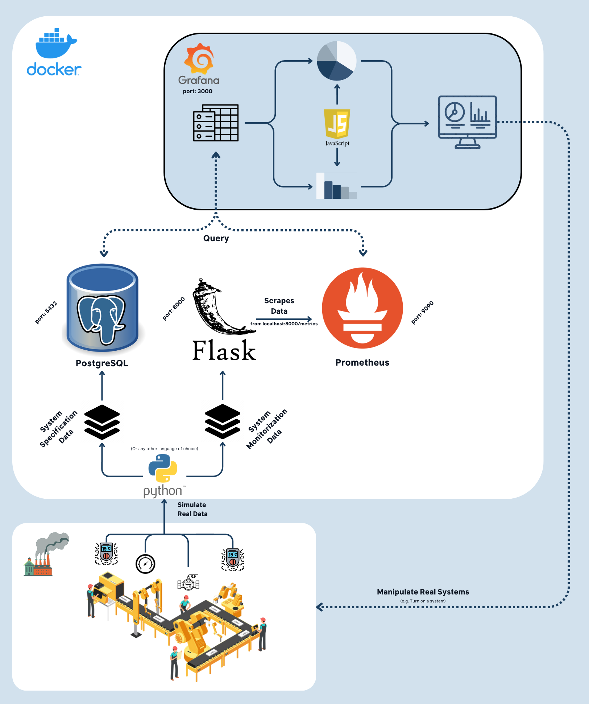

# Product Management

## Product Vision

Explain in few paragraphs what is the product vision that will guide the development of your product. Keep within ~1500 characters and user as reference the _Vision_ pattern in [The Scrum Book](http://scrumbook.org/).

## Market Research

The following is a thorough survey of similar products and their pros and cons. The goal is to provide valuable insights into making an informed decision about our project and how to position it effectively in relation to our client.

### Siemens Manufacturing Execution System (Siemens MES)

**Pros:**
- Strong integration capabilities with Siemens PLCs and automation equipment.
- Robust real-time monitoring and data collection features.
- Extensive reporting and analytics functionalities.
- Well-established in various industries, making it a reliable choice for large enterprises.

**Cons:**
- Can be expensive to implement, especially for smaller organizations.
- Requires specialized Siemens hardware in some cases, limiting flexibility.

### Wonderware MES by AVEVA

**Pros:**
- Offers a comprehensive MES suite with modules for various functions.
- Good compatibility with a wide range of hardware and industrial equipment.
- Scalable from small to large-scale operations.
- Strong data visualization and analytics tools.

**Cons:**
- Licensing costs can be significant.
- Implementation and configuration can be complex.

### Rockwell Automation's FactoryTalk ProductionCentre

**Pros:**
- Excellent integration with Rockwell PLCs and control systems.
- Strong focus on production workflow management.
- Extensive support for predictive maintenance.
- User-friendly interface and reporting.

**Cons:**
- Primarily tailored for Rockwell hardware and may require adaptation for other equipment.
- Initial setup can be time-consuming.

### Epicor Mattec MES

**Pros:**
- Specialized in real-time monitoring and data collection for manufacturing processes.
- Easy integration with various industrial machines.
- Offers machine connectivity and IIoT capabilities.
- Provides robust reporting and analytics tools.

**Cons:**
- Primarily focused on real-time monitoring, may lack some advanced workflow management features.
- Costs may vary depending on the scale of implementation.

### Plex Systems MES

**Pros:**
- Cloud-based MES offering flexibility and scalability.
- Provides a comprehensive suite for MES functions.
- Strong data visualization, analytics, and reporting capabilities.
- Offers IIoT connectivity.

**Cons:**
- May not be suitable for organizations with strict data security requirements.
- Cost can add up over time with subscription-based pricing.

With this in mind, we can infer that our project should be based on open-source software, with low maintenance cost and high modularity and availability.

## Domain Analysis

According to the project guidelines, we achieved a consensus on the following domain analysis:

This diagram represents the main entities of our project and how it would be integrated towards the first Sprint. It shows the relation between the different entities and the data flows within them. The main entities are the following:

- **Factory**: The factory is the main entity of the project. It represents the factory where the production takes place. It has multiple systems, those containing multiple sensors attatched to it. The data from the sensors are fetched by the systems and sent to a central server (which we represented as a python instance).

- **Python Instance**: This istance, for the first part of the project, holds the data from the sensors (or should we say, it simulates it) and sends it to the databases.

- **Databases**: The present databases holds 2 types of data: the data from the sensors and the static data from the systems themselfs.
    
    - **PostgreSQL**: This database holds the static data from the systems. This data is used to create the factories themselfs, systems, expansions and the sensors. It also holds the thresholds values of the sensors.
    
    - **Prometheus**: This database holds the data from the sensors. It is used to create the graphs and the alerts. Prometheus scrapes the data that the python instance generated and sent to the **Flask** server. This flask server, exposes the data via HTTP, so that Prometheus can scrape it at a given interval.

- **Grafana**: Grafana is the tool that is used to display the metrics to the final user. It shows the metrics via dashboards, and also displays alerts when they are triggered. The Grafana instance queries both the **Prometheus** and the **PostgreSQL** databases on a given interval and dashboard load, respectively. The user can manipulate the queries that are sent in an intuitive way, so that he can filter the data that he wants to see. From here, the user can also trigger any action through the outside systems, just like turning off a system.

## Sprint Reviews

Record of each sprint review, stating *when* they happened, *which version* was demonstrated (refer to specific git tags and/or version number of the product increment), and the main feedback provided by the customer. Refer also to the consequences of that feedback to the planning of the product, when relevant.
