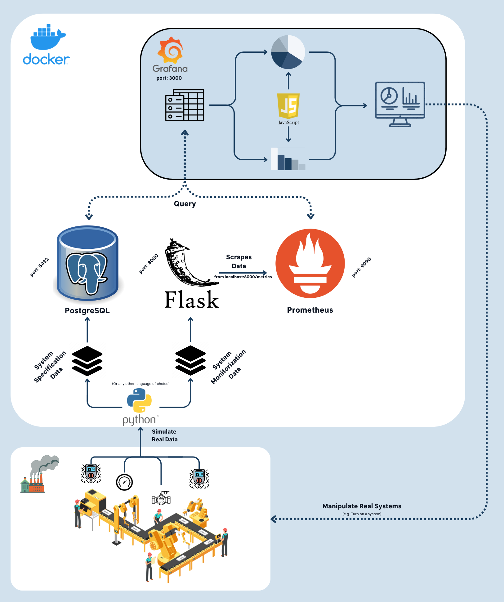
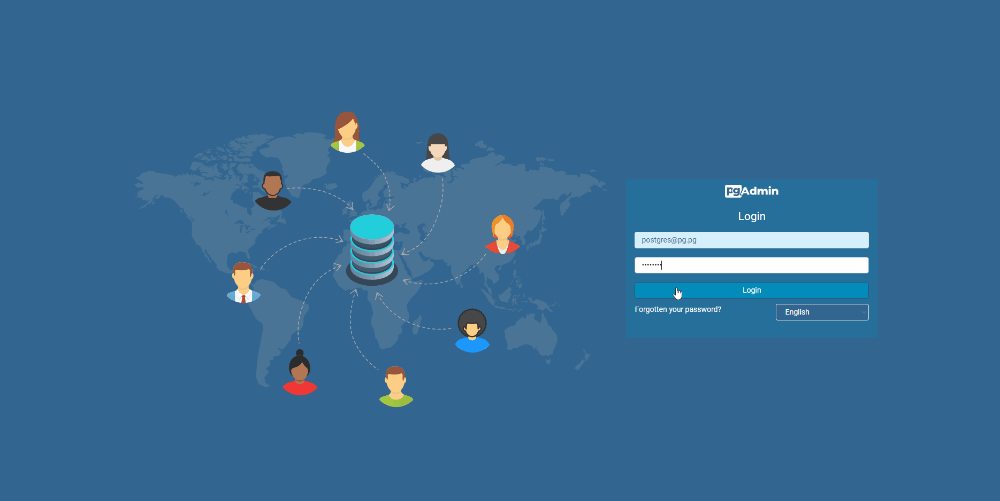
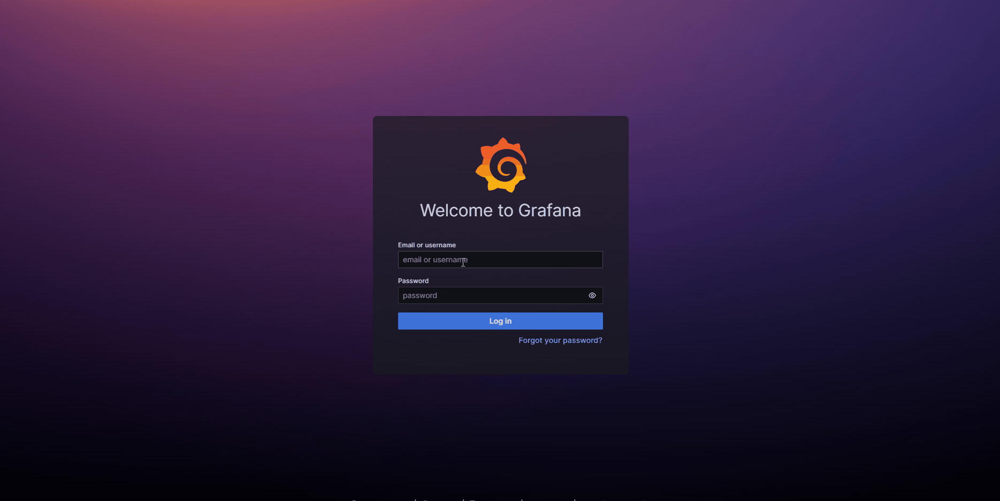

# P3: MES for Industrial Automation - Mockup Demo

If you have any doubts or dificulties, feel free to contact me through Discord.

## Table of Contents

- [Clarification](#clarification)
- [Introduction](#introduction)
- [Requirements](#requirements)
- [Installation / Setup](#installation--setup)
- [Usage](#usage)
  - [pgAdmin](#pgadmin)
  - [Flask](#flask)
  - [Prometheus](#prometheus)
  - [Grafana](#grafana)
- [Post](#post)


## Clarification

Beforehand, the data, models and structures seen here may not be used for the real project. This is just a mockup demo to show the functionalities of the tools that can be used in the project.

## Introduction

This repository contains the source code and necessary tools for a simplified mockup demo using `Grafana`, `PostgreSQL`, and `Prometheus`. The demo is intended to show the functionalities of these tools for the **MES for Industrial Automation project**.

## Requirements

- [Docker](https://www.docker.com/) or [Docker Desktop](https://www.docker.com/products/docker-desktop/)
- [Python 3](https://www.python.org/downloads/) (At least version 3.8)
- [pip](https://pip.pypa.io/en/stable/installing/)

## Installation / Setup

First of all, make sure you are in the root directory of the project.

If you are running **Windows**, you can use the `install.bat` script. Otherwise, if you are using **Linux**, you can use the `install.sh` script.

(If your python is tagged as `python3` instead of `python`, you will need to change the scripts accordingly)

This will install the necessary python packages and create the necessary docker containers, those being:
- `Grafana` running under the port `3000`;
- `pgAdmin` running under the port `4321`;
- `PostgreSQL` running under the port `5432`;
- `Prometheus` running under the port `9090`;
- `Flask` running under the port `8000`.

The script will populate the `PostgreSQL` database with the necessary tables and data after the containers are up and running.

Currently, the data generator script is not running, so the data in the database is going to be the same across the board, but you can remove the comment from the `data_generator()` function on the `main.py` file to produce fresh data.

The generated data consists of 3 facilities. Each facility has 5-10 systems. Each system has 2-5 expansions, and each expansion 1-2 sensors.

The idea for the SQL structure was taken from [here](https://www.festo.com/net/SupportPortal/Files/492858/Poster_DINA2_I4o_Solutions_205x292_EN_screen.pdf) and [here](https://www.festo.com/us/en/e/technical-education/educational-concepts/highlights/learning-factories/mps-mechatronics-learning-factories-id_31963/).


The following images shows the schematic of the system and the database representation:




## Usage

### pgAdmin

PgAdmin is a web interface for `PostgreSQL`. It will be essential to test your queries and to see the data in the database before using it in the `Grafana` dashboard.

To access the `pgAdmin` interface, go to `localhost:4321` and login with the following credentials:
```markdown
**Email**: postgres@pg.pg
**Password**: postgres
```

Then, add a new server with the following credentials:
```markdown
**Host name/address**: postgres  *(Under the docker network the hosts take the name you give them in the docker-compose file, instead of localhost)*
**Port**: 5432
**Maintenance database**: postgres
**Username**: postgres
**Password**: postgres
```



### PostgreSQL

If you rather, you can use the `psql` command to access the database. To do so, you need to access the `PostgreSQL` container through docker and run the `psql` command. You can do this by running the following command:
```bash
docker exec -it postgres psql -U postgres
```

You can use the file `data/push_to_db.py` to push data to the database.

Note: If you are having problems (for example, have postgres also installed on your machine), you can push the data manually on the `pgAdmin` interface through the `Query Tool` tab.

### Flask

The `Flask` server will query the `PostgreSQL` database and expose the data under `localhost:8000/metrics` for `Prometheus` to scrape. This data contains the generated value for each sensor in the database, that is being updated every few seconds.

You can enter the url in your browser to see the data that is being sent to `Prometheus`.

### Prometheus

To access the `Prometheus` interface, go to `localhost:9090`. 

To verify if the data is being scraped from the `Flask` server, go to the `Status > Targets` tab and check if the `sensor-job` is up and running. If it is, it should show `UP` under the `State` column.

On the `Expression` tab, you can enter a query to verify the data that is being scraped from the `Flask` server. For example, you can enter the following query:
```sql
sensor_value
-- or
sensor_value{sensor_id="1"}
```
The first one will show all the sensors data, while the second one will only show the value of the sensor with id `1`.

### Grafana

To access the `Grafana` interface, go to `localhost:3000`. Login with the following credentials:
```markdown
**Username**: admin
**Password**: admin
```

After logging in, you will be prompted to change the password, but you can skip it. After that, you will be redirected to the `Home Dashboard`.

From there, select on the left side the `Dashboards` tab. This will show the available dashboards folders. Select the `General` folder and then select the `General View` dashboard. 



Now, you can play around with the variables and see the data in the dashboard.

Note: If you wish to change the existing dashboards, that won't be possible because they are provisioned. You can import the same dashboards, that are stored under `grafana/provisioning/dashboards/general`, and change them as you wish. 

## Post

From here, I recommend you to play around with the tools and try to create your own dashboard. You can also try to create your own queries and see the results in the `pgAdmin` interface.

If you want to create your own dashboard, you can use the Grafana's built-in tools, but you are free to use plugins to achieve your desired needs. I recommend the following plugins:
- [Apache ECharts](https://grafana.com/grafana/plugins/volkovlabs-echarts-panel/). You can use the [Apache Echarts Playground](https://echarts.apache.org/examples/en/index.html) to tryout the different charts and see the code behind them;
- [Data Manipulation Plugin](https://grafana.com/grafana/plugins/volkovlabs-form-panel/);
- [Variable Panel](https://grafana.com/grafana/plugins/volkovlabs-variable-panel/);
- [Canvas Panel](https://grafana.com/docs/grafana/latest/panels-visualizations/visualizations/canvas/).

To install any plugin, you need to access the Grafana's terminal through docker and run the install command for the plugin you want, following by a restart of the Grafana server.

Also, [here](https://play.grafana.org/dashboards) you can find some examples.