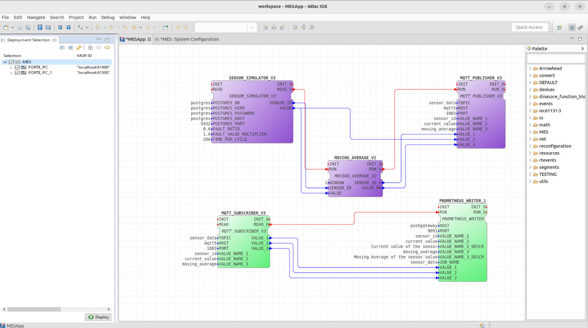
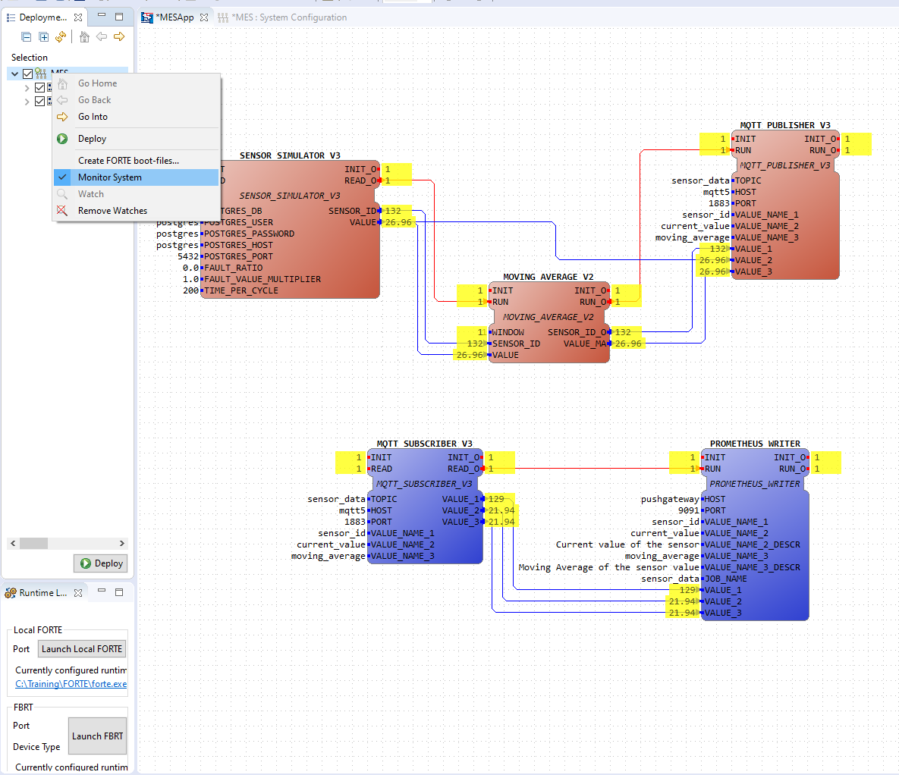

## Contents

- [Installation Guide](#installation-guide)
- [How to Run](#how-to-run)
- [Troubleshooting](#troubleshooting)
- [What Have We Achieved](#what-have-we-achieved)
- [Learn More](#learn-more)
- [References](#references)

## Installation Guide

- Proceed to install the [requirements](../config/requirements.txt) if you haven't already, by running the [install.bash](../install.bash) if you are on Linux/Mac or the [install.bat](../install.bat) if you are on Windows.

- Install 4DIAC-IDE for your system, using any these permalinks:
    - [4diac IDE 1.11.0 Windows 64-bit](http://www.eclipse.org/downloads/download.php?file=/4diac/releases/1.11/4diac-ide/4diac-ide-incubation_1.11.0-win32.win32.x86_64.zip)
    - [4diac IDE 1.11.0 Linux 64-bit](http://www.eclipse.org/downloads/download.php?file=/4diac/releases/1.11/4diac-ide/4diac-ide-incubation_1.11.0-linux.gtk.x86_64.tar.gz)
    - [4diac IDE 1.11.0 Mac OS X](http://www.eclipse.org/downloads/download.php?file=/4diac/releases/1.11/4diac-ide/4diac-ide-incubation_1.11.0-macosx.cocoa.x86_64.dmg)

    **NOTE**: In case the permalinks get outdated, you can install using the from this [online folder](https://drive.google.com/drive/folders/1BG9jSN6q5V6J5MTj7w3r6gF6OH6iEOvm)

    **NOTE**: For more details about the 4DIAC-IDE, check this [link](https://eclipse.dev/4diac/en_help.php?helppage=html/4diacIDE/overview.html).

    **NOTE**: After instalation, ensure you have the 4DIAC-IDE outside of the root of this project, otherwise it will be submited to git.

- (Optional for now) Install [Prosys OPC UA Browser 4.4.0-126](https://www.prosysopc.com/products/opc-client/). This OPC client can be used to observe the results of the OPC UA server built in DINASORE.


## How to Run

- Make sure you have all the docker containers running. You will need to have **PostgreSQL**, **MQTT-Broker** and **Pushgateway** running, which have `5432`, `1883` and `9091` ports associated, respectively.

- In order to run DINASORE on your system, you need to run the following commands:
    ```sh
    # Move to the dinasore's root folder
    cd src/dinasore

    # Default values: 
    # <ip_address>=localhost, <port_diac>=61499, 
    # <port_opc>=4840, <log_level>=ERROR,
    # <number_samples>=5, <seconds_per_sample>=20
    python core/main.py -a <ip_address> \ 
                        -p <port_diac> \
                        -u <port_opc> \
                        -l <log_level> \
                        -m <number_samples> <seconds_per_sample>

    ```

    **NOTE**: For Mac and Linux users, run with the flag -B to avoid the creation of cache folders (conflicts with the FBs folders): ```python -B core/main.py```

    For this project, we need to run two instances of DINASORE, one for the FORTE_PC and another for the FORTE_PC_1. For that, you can run the following commands:
    ```sh
    # On the first terminal

    python core/main.py

    # And on another terminal

    python core/main.py -p 61500 -u 4841
    ```


- Now, you can open the 4DIAC-IDE and import the [function blocks folder](./resources/function_blocks/). For that, you can follow the next steps:
    1. Open the 4DIAC-IDE
    2. Go to File -> New -> New System -> *Name the project as *MES*** -> Finish
    3. On the System Explorer, left click to open the **MES** -> Right click on the **Type Library** -> Import -> General -> File System -> Next -> Browse -> Select the [function blocks folder](./resources/function_blocks/) -> Finish
    4. On the System Explorer, open **System Configuration** (**1**). Now add 2 FORTE_PC (**2**) and 1 Ethernet (**3**). Link the Forte PCs to the Ethernet (**4**). Update the port of the second FORTE_PC to 61500 (**5**).

        

    5. On the System Explorer, open **MESApp**
    6. From the palette on the right side, drag the following function blocks:
        - **SENSOR_SIMULATOR_V2**
        - **MOVING_AVERAGE_V2**
        - **MQTT_PUBLISHER_V3**
        - **MQTT_SUBSCRIBER_V3**
        - **PROMETHEUS_WRITER**

        
    7. Now, proceed to link the function blocks and fill the parameters with:
        - **SENSOR_SIMULATOR_V2**: OFFSET = 0. You can twist this value to emulate, for example, a sensor that can overheat (Offset = 10) or a sensor that is working above the desired temperature (Offset = -10).
        - **MOVING_AVERAGE_V2**: WINDOW = 5. This value is the number of samples that the moving average will use to calculate the average value. You can change this value to see how the moving average changes.
        - **MQTT_PUBLISHER_V3**: 
            - TOPIC = "sensor_data". This is the topic that the publisher will use to publish sensor data to.
            - HOST = "localhost". This is the IP address of the MQTT Broker on your machine.
            - PORT = 1883. This is the port of the MQTT Broker on your machine.
            - VALUE_NAME_1 = "sensor_id". This is the id of the sensor.
            - VALUE_NAME_2 = "current_value". This is the current value of the sensor.
            - VALUE_NAME_3 = "moving_average". This is the moving average of the sensor.
        - **MQTT_SUBSCRIBER_V3**:
            - TOPIC = "sensor_data". This is the topic that the subscriber will use to subscribe to.
            - HOST = "localhost". This is the IP address of the MQTT Broker on your machine.
            - PORT = 1883. This is the port of the MQTT Broker on your machine.
            - VALUE_NAME_1 = "sensor_id". This is the id of the sensor.
            - VALUE_NAME_2 = "current_value". This is the current value of the sensor.
            - VALUE_NAME_3 = "moving_average". This is the moving average of the sensor.
        - **PROMETHEUS_WRITER**:
            - HOST = "localhost". This is the IP address of the Prometheus Gateway running on docker.
            - PORT = 9091. This is the port of the Prometheus Gateway running on docker.
            - VALUE_NAME_1 = "sensor_id". This is the id of the sensor.
            - VALUE_NAME_2 = "current_value". This is the current value of the sensor.
            - VALUE_NAME_2_DESCR = "Current value of the sensor". This is the description of the current value of the sensor.
            - VALUE_NAME_3 = "moving_average". This is the moving average of the sensor.
            - VALUE_NAME_3_DESCR = "Moving average of the sensor". This is the description of the moving average of the sensor.
            - JOB_NAME = "sensor_data". This is the job name of the sensor data.

        
        
        NOTE: Make sure to link the function blocks as shown in the image above. This step is important to ensure that the function blocks are linked in the correct order and that it follows the flow of the data.

    8. Link the function blocks to the corresponding FORTE_PC:
        - **SENSOR_SIMULATOR_V2**, **MOVING_AVERAGE_V2**, **MQTT_PUBLISHER_V3**: Right click on the function block -> Select "Map to .." -> Select "FORTE_PC" -> Select "EMB_RES"
        - **MQTT_SUBSCRIBER_V3**, **PROMETHEUS_WRITER**: Right click on the function block -> Select "Map to .." -> Select "FORTE_PC_1" -> Select "EMB_RES"

        

    9. Now the systems are ready for deploy. Change to the **Deploy View** (right corner icon or Window -> Perspective -> Open Perspective -> Deployment);

    10. Select your configuration and click Deploy to upload the configuration to the Smart Components;

        

    11. To monitor the system, change to the previous view, then right-click on the project folder, and select Monitor System. Now you can select which variables you want to monitor, for that right-click inside the variable and select Watch;

        

    12. To stop the monitoring process, right-click in the project folder and select Remove Watches and unselect Monitor System;

    13. If you want to reset each component, right-click in his name in the left bar and select Delete all Resources;

    14. Finally, to check the data structure or monitor the process using OPC-UA, you can use the [Prosys client](https://www.prosysopc.com/products/opc-client/), connecting to the component IP address at port 4840 and 4841.

## Troubleshooting

If you are having any kinds of problem, please try to follow the [dinasore tutorials](https://github.com/DIGI2-FEUP/dinasore/wiki/3.-Tutorials-Resume). They follow similar steps to the ones described above, but with more details that could help you.

Either ways, if you are still having problems, please contact [João Araújo](../../factsheets/team1/joao_araujo.md).

## What Have We Achieved

- We have created a system that retrieves the existing sensors from the **PostgreSQL** database and simulates the data of each existing sensor. Then, the system calculates the moving average of the sensor data and publishes the data to a MQTT Broker. Then, another system subscribes to the MQTT Broker and writes the data to a **Prometheus Gateway**, so that it can be monitored using **Grafana**.

- It is important to add that while we are working on mock data, the system is ready to work with real data. For that, we just need to change the **SENSOR_SIMULATOR_V2** function block to a function block that reads the data from the real sensor later on.

## Learn More

- [DINASORE - A tool for distributed function-block-based systems](https://medium.com/@jrffmatias/dinasore-a-tool-for-distributed-function-block-based-systems-f2613a37e1ca). This article explains the main features of DINASORE with a simple example.

- [DINASORE - Build new function blocks](https://github.com/DIGI2-FEUP/dinasore/wiki/2.1.-Build-new-Function-Blocks). This wiki guide explains how you can create your own function blocks written in C#, Python, or Java.

- [Prosys OPC UA Browser 4.4.0-126](https://www.prosysopc.com/products/opc-client/). This OPC client can be used to observe the results of the OPC UA server built in DINASORE.

- [Step 0 - 4diac IDE Overview](https://eclipse.dev/4diac/en_help.php?helppage=html/4diacIDE/overview.html). This page explains how you can setup the 4diac IDE and how to use it more explicitly.

## References

This project was developed using DIGI2 [Dinasore](https://github.com/DIGI2-FEUP/dinasore) and this readme was based on their [installation guide](https://github.com/DIGI2-FEUP/dinasore/wiki/1.-Install), constricting to the needs of our project.
